<!-- BEGIN GENERATED ISLAND PROFILE -->

<!-- Generated by jasvir/jasvir.github.io. Edit dist/content.js and profile/config.js, then rebuild. -->

Around the islands

<a href="https://jasvir.github.io/">Expand...</a>

Two Dozen

<a href="https://jasvir.github.io/#entry-two-dozen">Expand...</a>

SecretSeal

<a href="https://jasvir.github.io/#project-secretseal">Expand...</a>

Trapdoor VMs

<a href="https://jasvir.github.io/#project-trapdoor">Expand...</a>

About Me

<a href="https://jasvir.github.io/#entry-homepage">Expand...</a>

<!-- END GENERATED ISLAND PROFILE -->
